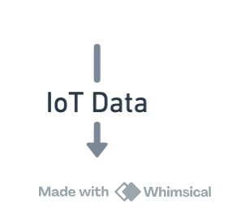

### API Endpoints

- **GET /analytics/weekly_summary** - Retrieves a weekly summary of analytics.
- **GET /rooms/<room_id>/thresholds** - Retrieves the current thresholds for CO2 and temperature for a specific room.
- **PUT /rooms/<room_id>/thresholds** - Updates the CO2 and temperature thresholds for a room.
    - **Request Body**: JSON object with optional fields `co2_threshold` and `temperature_threshold`.

### Example Requests

- **Get Weekly Summary**
  ```bash
  curl -X GET http://127.0.0.1:5000/analytics/weekly_summary
  ```
- **Update Room Thresholds**
  ```bash
  curl -X PUT -H "Content-Type: application/json" \
  -d '{"co2_threshold": 750, "temperature_threshold": 22}' \
  http://127.0.0.1:5000/rooms/101/thresholds


  ```


  # Smart Hotel Project

## Overview
This project simulates a smart hotel management system with features like IoT data logging, real-time analytics, SMS alerts, and a chatbot interface powered by OpenAI.

## Features
- Real-time IoT data logging and analytics
- Scheduled alerts and notifications
- Role-based access control for different users
- Gradio interface for guest interactions
- Integration with Azure OpenAI API and Twilio for SMS alerts

## Setup Instructions

1. Clone the repository:

