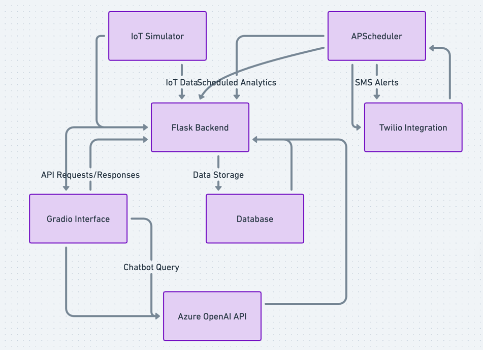
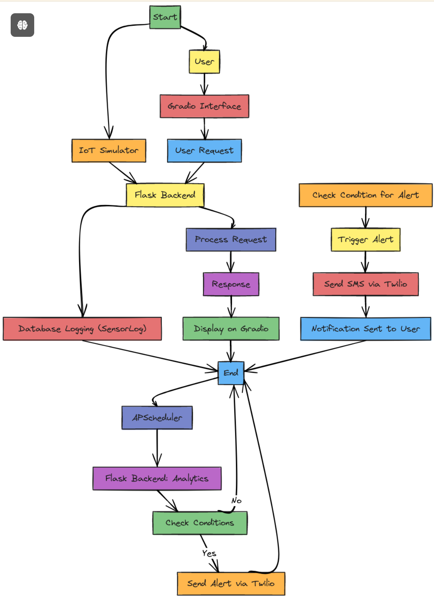

### API Endpoints

- **GET /analytics/weekly_summary** - Retrieves a weekly summary of analytics.
- **GET /rooms/<room_id>/thresholds** - Retrieves the current thresholds for CO2 and temperature for a specific room.
- **PUT /rooms/<room_id>/thresholds** - Updates the CO2 and temperature thresholds for a room.
    - **Request Body**: JSON object with optional fields `co2_threshold` and `temperature_threshold`.

### Example Requests

- **Get Weekly Summary**
  ```bash
  curl -X GET http://127.0.0.1:5000/analytics/weekly_summary
  ```
- **Update Room Thresholds**
  ```bash
  curl -X PUT -H "Content-Type: application/json" \
  -d '{"co2_threshold": 750, "temperature_threshold": 22}' \
  http://127.0.0.1:5000/rooms/101/thresholds


  ```


  # Smart Hotel Project

## Overview
This project simulates a smart hotel management system with features like IoT data logging, real-time analytics, SMS alerts, and a chatbot interface powered by OpenAI.

## Features
- Real-time IoT data logging and analytics
- Scheduled alerts and notifications
- Role-based access control for different users
- Gradio interface for guest interactions
- Integration with Azure OpenAI API and Twilio for SMS alerts

## Setup Instructions

1. Clone the repository:
https://github.com/sumitrawal658/smart_hotel.git




2. Create a virtual environment and activate it:
```bash
python3 -m venv venv source venv/bin/activate # On Windows: venv\Scripts\activate%
```

3. Install the required packages:
```bash 
pip install -r requirements.txt
```

4. Set up the environment variables:
```bash 
export FLASK_APP=app.py export FLASK_ENV=development
AZURE_ENDPOINT="https://gpt-candidate-test.openai.azure.com/" 
API_KEY="your_api_key" 
ASSISTANT_ID="your_assistant_id" 
TWILIO_ACCOUNT_SID="your_twilio_account_sid" 
TWILIO_AUTH_TOKEN="your_twilio_auth_token"
 TWILIO_PHONE_NUMBER="your_twilio_phone_number"
```

5. Run the Flask app:
```bash
flask run # Starts the Flask backend python interface.py # Starts the Gradio interface
```
## Usage
- Access the Gradio interface at `http://127.0.0.1:7860`.
- Sample API endpoints:
  - `GET /analytics/weekly_summary`
  - `GET /rooms/<room_id>/thresholds`
  - `PUT /rooms/<room_id>/thresholds`
  - `GET /logs/<room_id>/latest`

Flow Chart




Certainly! Here’s a concise explanation for each choice, detailing why each tool and library was selected for this project:

---

### Reasoning

#### 1. **Why Flask?**
   - **Lightweight and Minimalistic**: Flask is a micro-framework, meaning it provides the essentials without unnecessary complexity, making it ideal for building lightweight APIs.
   - **API-Centric**: Flask is commonly used for RESTful APIs due to its simplicity, extensibility, and ease of integration with various extensions and libraries.
   - **Flexibility**: Flask allows for easy customization and configuration, which is ideal for a project that integrates multiple services (like IoT data, Twilio, and Gradio).

#### 2. **Why Twilio?**
   - **Reliable and Widely Used**: Twilio is one of the most trusted platforms for SMS and communications, providing reliable delivery with global reach.
   - **Ease of Integration**: Twilio’s Python library allows for seamless SMS integration, enabling notifications to be triggered from the backend without complex setups.
   - **Scalability**: As the project grows, Twilio can scale with it, offering various communication channels (SMS, voice, email) if needed in the future.

#### 3. **Why Gradio?**
   - **Quick and User-Friendly UI**: Gradio simplifies creating user interfaces for AI/ML models and data-driven applications, which is perfect for a smart hotel assistant.
   - **Real-Time Interactivity**: Gradio allows users to interact with the backend in real-time, making it ideal for querying IoT data or controlling devices with minimal setup.
   - **Ease of Deployment**: Gradio apps can run locally or be deployed easily, making it a flexible choice for creating a chatbot-like interface for guests.

---

### Justification of Other Libraries

#### 1. **APScheduler** (Advanced Python Scheduler)
   - **Scheduling Support**: APScheduler provides robust scheduling features that allow the backend to handle recurring tasks, like analytics calculations and alert checks, at specified intervals.
   - **Flexible and Configurable**: It supports various scheduling options (cron jobs, intervals, etc.), which is essential for automating tasks such as daily or weekly summaries.
   - **Seamless Flask Integration**: APScheduler integrates well with Flask, making it easy to manage periodic tasks without a separate scheduler or job runner.

#### 2. **SQLAlchemy**
   - **ORM Capabilities**: SQLAlchemy is a powerful Object-Relational Mapper (ORM) that simplifies database interactions by allowing us to work with Python classes instead of raw SQL.
   - **Ease of Database Management**: It provides a high-level interface for managing database operations, allowing for flexibility in defining relationships and managing queries, which is essential for the IoT data structure.
   - **Compatibility with Flask**: SQLAlchemy has strong support for Flask through the Flask-SQLAlchemy extension, making it a natural fit for this project’s data persistence needs.

#### 3. **Flask-Migrate**
   - **Database Migrations**: Flask-Migrate, based on Alembic, is used to handle database migrations. This is critical when evolving the database schema (e.g., adding new fields or tables).
   - **Version Control for Database**: It enables easy version control of database changes, making the development process smoother and reducing risks associated with schema updates.

#### 4. **Requests Library**
   - **HTTP Requests**: The Requests library is used for making HTTP requests to the IoT simulator and other external APIs. It simplifies sending GET and POST requests and handling responses.
   - **Ease of Use**: Requests is known for its user-friendly syntax, making HTTP interactions straightforward and reliable.

---

### Summary

These libraries and tools were chosen based on their suitability for the project’s requirements, their ease of integration with Flask, and their ability to handle specific tasks like scheduling, database management, and user interaction.

- **Flask** provides a lightweight and flexible foundation.
- **Twilio** offers reliable communication for alerts.
- **Gradio** facilitates an interactive, user-friendly interface.
- **APScheduler** manages scheduled tasks like analytics and alerts.
- **SQLAlchemy and Flask-Migrate** enable robust database management and schema evolution.
- **Requests** allows seamless HTTP communication with external services.

---

## License
This project is licensed under the MIT License.


