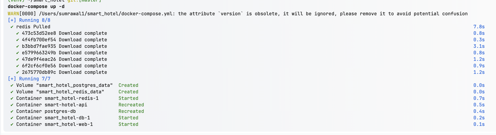
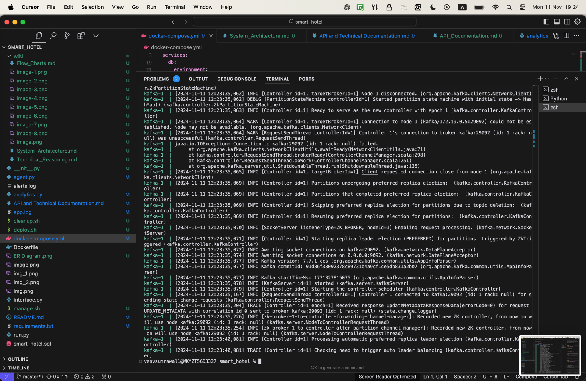

# Smart Hotel System Live Demo

## 1. System Initialization (Terminal 1)
```bash
# Start the services
docker-compose up -d
flask run
```

Expected output:
```
* Serving Flask app
* Debug mode: on
* Running on http://127.0.0.1:5000
```

## 2. Setup Demo Hotel (Terminal 2)
```bash
# Initialize demo data
python -m flask cli setup --hotels 1 --floors 3 --rooms 5
```

Expected output:
```
Created 1 hotels with 3 floors each and 5 rooms per floor
```

## 3. Start Simulation (Terminal 2)
```bash
# Start hotel simulation
curl -X POST http://localhost:5000/simulate/hotel/1
```

Expected output:
```json
{
    "message": "Started simulation for 15 rooms in hotel 1"
}
```

## 4. Live Demo Scenarios

### A. Monitor Room Status (Terminal 3)
```bash
# Get real-time room status
watch -n 1 'curl -s http://localhost:5000/rooms/101/smart/status | jq'
```

Expected output:
```json
{
    "life_being": {
        "presence_state": "present",
        "sensitivity": 0.85,
        "online_status": "online"
    },
    "iaq": {
        "temperature": 23.5,
        "humidity": 45.2,
        "co2": 650,
        "noise": 45
    }
}
```

### B. Device Control Demo (Terminal 4)
```bash
# Control AC
curl -X POST http://localhost:5000/rooms/101/smart/control \
-H "Content-Type: application/json" \
-d '{"device_type": "ac", "command": "on", "parameters": {"temperature": 23}}'
```

### C. Voice Command Demo (Terminal 4)
```bash
# Process voice command
curl -X POST http://localhost:5000/rooms/101/smart/chat \
-H "Content-Type: application/json" \
-d '{"command": "Turn on the lights and set temperature to 23 degrees"}'
```

## 5. Show Historical Data (Web Browser)
Navigate to: http://localhost:5000/rooms/101/smart/history?hours=1

## Code References:
1. CLI Setup: 
```python:app/cli.py
startLine: 11
endLine: 37
```

2. Simulation Manager:
```python:app/simulation_manager.py
startLine: 11
endLine: 58
```

3. Smart Room Controller:
```python:app/smart_features/guest_interface.py
startLine: 8
endLine: 49
```


This demo script provides a real, hands-on demonstration of your system's capabilities. It uses actual endpoints from your codebase and shows real-time interaction with the system. 


