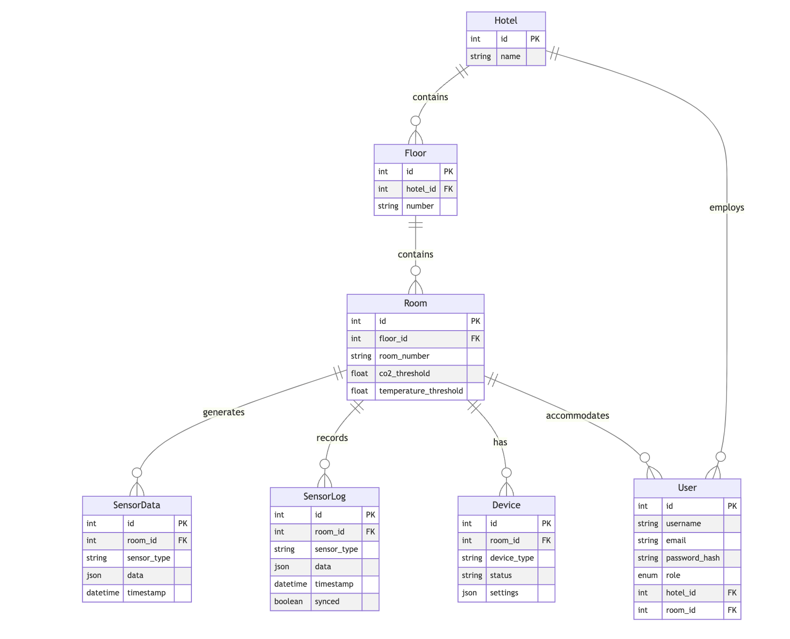

# Database Entity Relationship Diagram 

## Relationship Details

### One-to-Many Relationships
1. Hotel → Floor
   - A hotel contains multiple floors
   - Each floor belongs to one hotel

2. Floor → Room
   - A floor contains multiple rooms
   - Each room belongs to one floor

3. Room → SensorData/SensorLog
   - A room has multiple sensor readings
   - Each sensor reading belongs to one room

### User Relationships
1. Hotel → User
   - A hotel can have multiple staff users
   - Each staff user is assigned to one hotel

2. Room → User
   - A room can have multiple guest users
   - Each guest user is assigned to one room

### Device Management
1. Room → Device
   - A room has multiple devices (AC, TV, lights)
   - Each device belongs to one room

## Data Types and Constraints

### Primary Keys
- All entities use auto-incrementing integer IDs
- Composite relationships maintained through foreign keys

### Special Fields
1. JSON Data Storage
   - SensorData.data: Stores sensor readings
   - SensorLog.data: Stores historical data
   - Device.settings: Stores device configurations

2. Enumerated Types
   - User.role: Enum(UserRole) [GUEST, STAFF, MANAGER, ADMIN]

3. Timestamps
   - SensorData.timestamp: Automatic timestamp
   - SensorLog.timestamp: UTC timestamp

## Indexing Strategy
- Foreign keys are indexed for performance
- Timestamp fields are indexed for time-series queries
- Room number and sensor type combinations are indexed for quick lookups

## Data Integrity
- CASCADE delete operations from Hotel → Floor → Room
- RESTRICT delete operations for User relationships
- Nullable foreign keys for optional relationships

This ER diagram shows all the relationships between your database entities, with proper cardinality and field definitions. The diagram is created using Mermaid markdown syntax, which GitHub Wiki supports natively