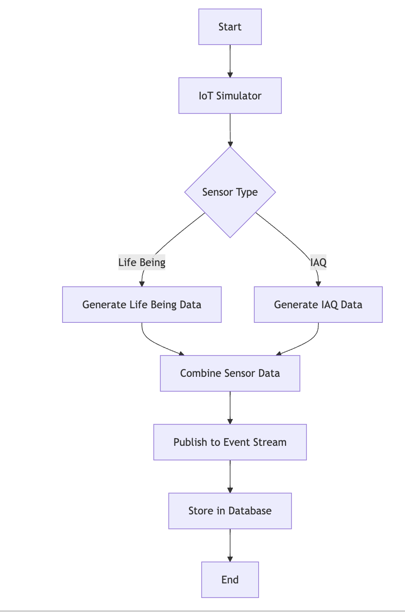
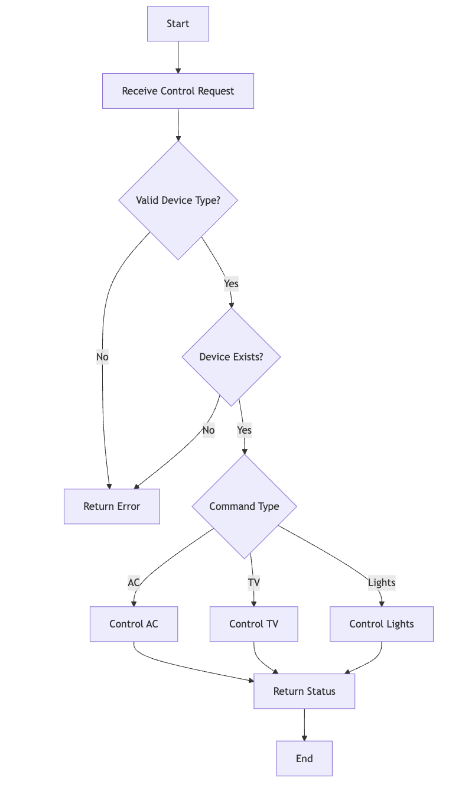
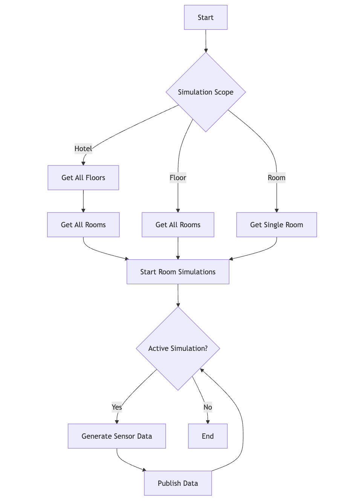
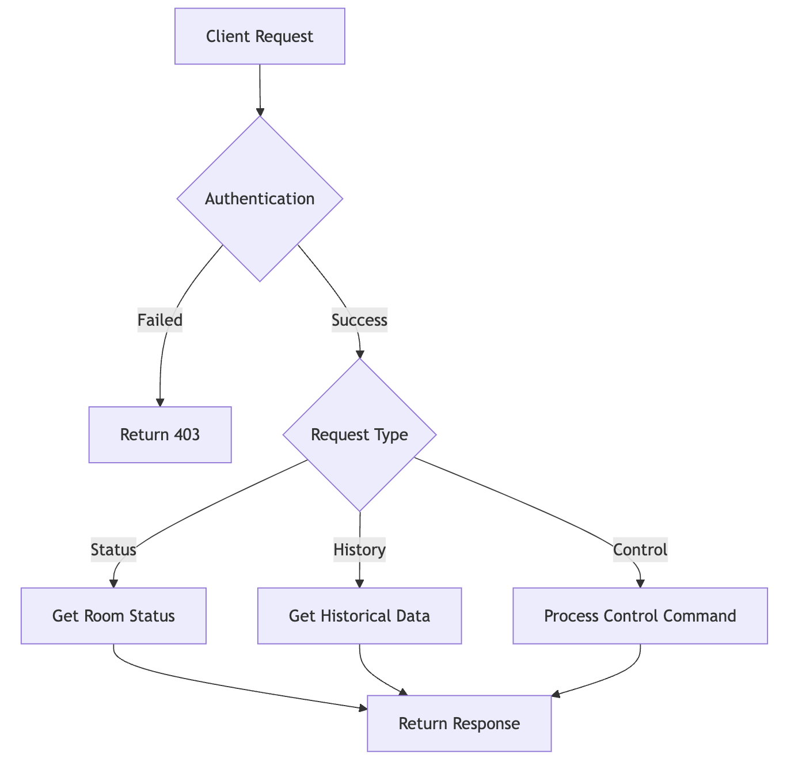
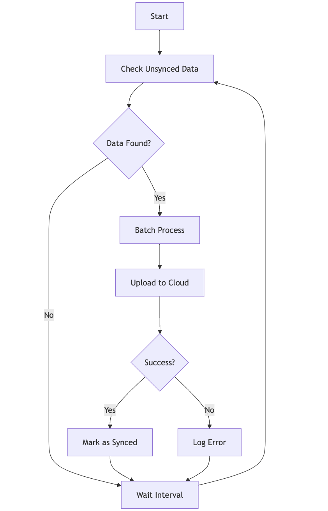

# Process Flow Charts

## 1. Sensor Data Collection Flow 

## 2. Room Control Process

Reference: `app/iot_simulator.py`, lines 1-30

## 3. Simulation Management Flow

Reference: `app/simulation_manager.py`, lines 10-58

## 4. API Request Flow

Reference: `app/smart_features/routes.py`, lines 11-49

## 5. Data Synchronization Flow

Reference: `app/routes.py`, lines 155-166

These flow charts represent the main processes in your system, showing:
1. Sensor data collection and processing
2. Room device control logic
3. Simulation management
4. API request handling
5. Data synchronization

