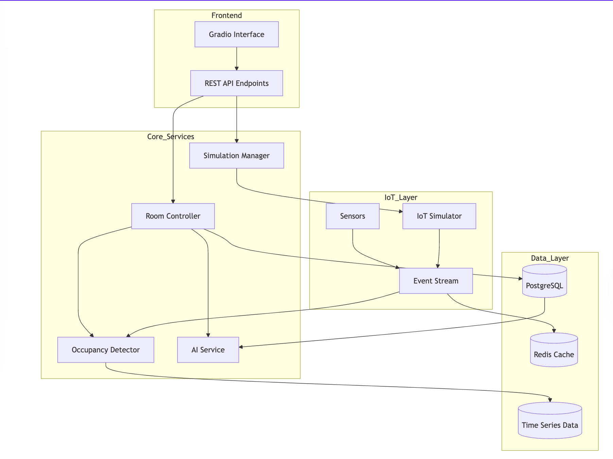
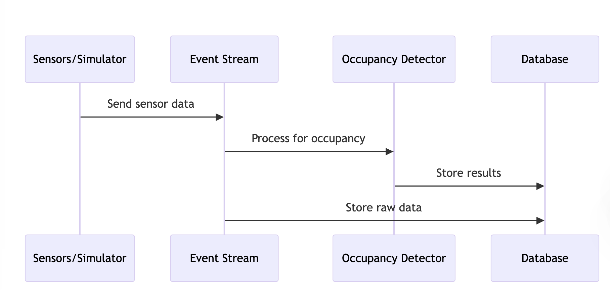
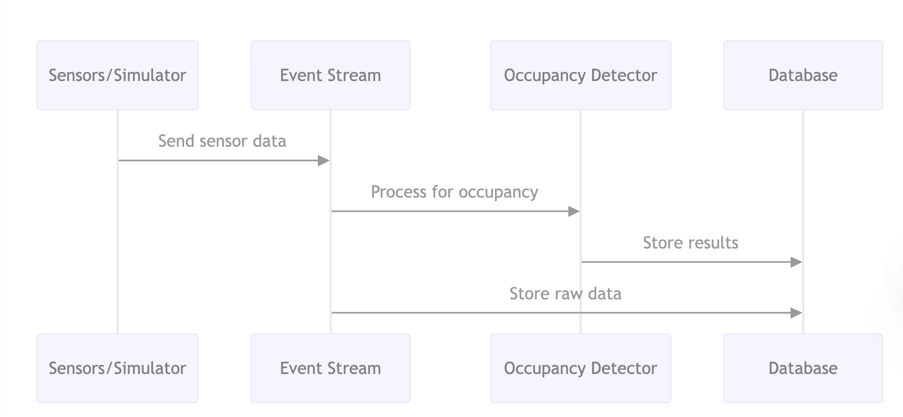

# System Architecture

## Core System Components

## Component Descriptions

1. **Frontend Layer**
   - Gradio Interface: Interactive UI for hotel staff and guests
   - REST API: Handles all HTTP requests (referencing `app/routes.py`, lines 18-35)

2. **Core Services**
   - Simulation Manager: Manages IoT device simulation (referencing `app/simulation_manager.py`, lines 10-58)
   - Occupancy Detector: Processes sensor data for room occupancy
   - AI Service: Handles intelligent room control and guest interactions
   - Room Controller: Manages individual room operations (referencing `app/smart_features/guest_interface.py`, lines 8-49)

3. **IoT Layer**
   - IoT Simulator: Generates sensor data (referencing `app/iot_simulator.py`, lines 1-30)
   - Event Stream: Handles real-time data flow
   - Sensors: Life Being and IAQ sensors

4. **Data Layer**
   - PostgreSQL: Primary database
   - Redis Cache: Real-time data caching
   - Time Series Data: Sensor data storage

## Event Streaming Layer

The system uses Apache Kafka for reliable event streaming:

1. **Data Flow**
   - IoT Simulator → Kafka → Data Processors
   - Message durability and replay capability
   - Scalable consumer groups for processing

2. **Components**
   - **Kafka Broker**: Message persistence and distribution
   - **Zookeeper**: Cluster management
   - **Producers**: IoT simulators and sensors
   - **Consumers**: Data logger and occupancy detector

3. **Integration Points**
   - Connects IoT Layer with Processing Layer
   - Enables real-time data processing
   - Supports system scalability

## Data Flow

1. **Sensor Data Flow**

2. **Control Flow**

## Scaling Configuration
The system is designed to handle:
- Up to 100 hotels
- 50 floors per hotel
- 30 rooms per floor
(referencing `app/scaling_config.py`, lines 1-13)

## Integration Points
- REST API endpoints for external systems
- Event streaming for real-time data
- Database interfaces for data persistence
- IoT simulation for testing and development 